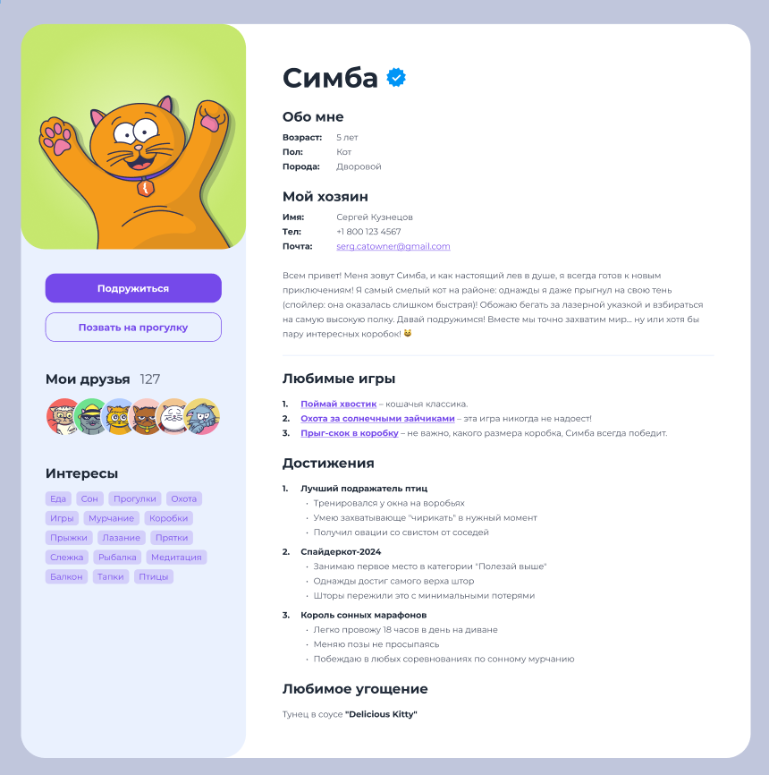

# 🐱 Social Media Cats

[](https://alexh73.github.io/social_media_cats/)
[](LICENSE)

Социальная сеть для владельцев кошек с возможностью публикации фото, лайков и комментариев.



## ✨ Особенности
- Просмотр ленты с котиками
- Загрузка новых фото питомцев
- Система лайков и комментариев
- Адаптивный интерфейс
- Анимации взаимодействия

## 🛠 Технологии
- HTML5
- CSS3
- CSS Modules
- GitHub Pages (деплой)

## 🚀 Запуск проекта

### Установка
```bash
git clone https://github.com/AlexH73/social_media_cats.git
cd social_media_cats
npm install
```

## 🌐 Демо-версия

Актуальная версия всегда доступна на GitHub Pages:  
[https://alexh73.github.io/social\_media\_cats/](https://alexh73.github.io/social_media_cats/)

## 🤝 Как помочь проекту

1.  Форкните репозиторий
    
2.  Создайте ветку для фичи/исправления
    
3.  Запушьте изменения
    
4.  Откройте pull request
    

## 📄 Лицензия

Проект распространяется под лицензией MIT. Подробнее в файле [LICENSE](./LICENSE/).

___

> С любовью к котикам 😻 · [AlexH73](https://github.com/AlexH73)

